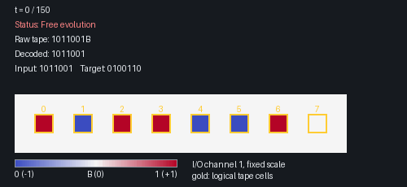

# ncpu-computer

`ncpu-computer` studies computation learned as the dynamics of a small neural
cellular automaton (NCA). One local neural rule is applied at every grid cell
and every timestep. The grid provides working memory, and repeated updates
provide computation time.

Inputs and outputs use a one-dimensional logical tape embedded in the
two-dimensional grid. The current baseline learns one task at a time on a fixed
grid. The longer-term goal is to condition one shared rule with learned programs
for different tasks.



This is an actual trajectory of a five-channel bitwise-NOT model. It overwrites
`1011001` with `0100110`, followed by a blank. The shown seed was trained on all
binary strings of lengths 1 through 7 and achieves 100% whole-tape and
interpreted accuracy throughout its full supervision window.

## Tape interface

The model's logical interface is a finite sequence over three symbols. In the
implementation, the complete sequence is represented directly as a tensor; no
Python-string processing occurs inside the NCA.

| Symbol | Tensor value | Role |
|---|---:|---|
| `0` | `-1` | Data symbol zero |
| `1` | `+1` | Data symbol one |
| `B` | `0` | Blank or separator |

`B` fills unused tape positions, so an output may be shorter than the available
tape. It can also separate multiple serialized values. All three symbols are
valid supervised targets; `B` is not an ignored or masked value.

For example, the integer operands 7 and 4 can be placed on one tape as:

```text
logical:  1  1  1  B  1  0  0
tensor:  +1 +1 +1  0 +1 -1 -1
```

### A general, type-independent boundary

The tape is a common representation boundary between external data and the
learned system. From the NCA's perspective, every task has the same type: an
input tensor representing a string over `{0, 1, B}`, transformed into another
tensor of the same form. The NCA is not told whether that string represents an
integer, a tuple, a Boolean sequence, or another finite discrete object.

A deterministic external codec defines the representation for each data type.
The reverse conversion, when needed, is performed by an external interpreter
after inference. These components are not learned and are not part of the NCA
dynamics:

```text
typed data
  -> external encoder
  -> ternary tape
  -> NCA computation
  -> ternary tape
  -> optional external interpreter
  -> typed result
```

The same interface therefore supports different semantics without changing the
model architecture:

| Task | Serialized input | Target content |
|---|---|---|
| Bitwise NOT | `00101` | `11010` |
| String reversal | `00101` | `10100` |
| Integer addition, 7 + 4 | `111B100` | `1011` |

The table omits unused capacity: in the training tensor, every position after
the target content is filled and supervised as `B`.

String tasks preserve leading zeroes. Integer codecs instead use minimal binary:
they remove leading zeroes and represent integer zero as `0`. Structured values
can use `B` as a field separator. Continuous or unbounded objects require a
defined finite serialization before they can use this interface.

Type independence here is an interface property, not a universality claim. A
task still determines the examples, codec, and output interpretation, and a
trained rule must empirically learn the corresponding transformation. The
benefit is that the NCA mechanism remains unchanged and the complete raw output
can be evaluated before any interpreter simplifies it.

## Grid layout and state

### Geometry

The tape has `N` logical positions, `x0 ... x(N-1)`, on one horizontal row.
Consecutive positions are separated by a configurable physical stride `s`.
With independently configurable borders, the grid dimensions are:

```text
height = top + 1 + bottom
width  = left + (N - 1) * s + 1 + right
```

Logical position `xi` has the zero-based coordinate:

```text
row    = top
column = left + i * s
```

```text
                 top working space

left working | x0 . x1 . x2 . ... . x(N-1) | right working

                bottom working space
```

Here `.` denotes an ordinary physical cell between tape positions. With the
library defaults (`N = 12`, `s = 2`, and three border cells on each side), the
grid is `7 x 29`; the tape occupies row 3 at columns `3, 5, ..., 25`.

Only the `xi` cells are read or supervised as tape symbols. The gaps and borders
are not ignored padding: they are mutable working space available to the NCA.
They begin at zero and may carry information during the rollout. A zero at a
logical position represents `B`; a zero elsewhere is simply the neutral initial
state of that physical cell.

### Channels

The default state has five channels:

| Channel | Role | Behavior |
|---:|---|---|
| 0 | Program | Read-only; currently zero everywhere |
| 1 | Input/output | Mutable |
| 2–4 | Computation | Mutable |

At timestep zero, the encoded input is left-aligned at `x0` in the I/O channel.
Unused tape positions are `B`, and all other state values start at zero. The
program channel is restored unchanged after every update.

Input and output occupy the same logical positions. The NCA therefore overwrites
the input rather than writing to a separate output channel. An output may be
shorter or longer than its input, up to the configured capacity `N`. Every
position after the target string is explicitly targeted as `B`.

## Local computation

Let `X_t` be the complete grid state and let `M` be one on mutable channels and
zero on the read-only program channel. Omitting optional stochastic firing for
clarity, one update is:

```text
D_t     = U_theta(P(X_t))
Y_t     = clip(X_t + M * D_t)
X_(t+1) = M * Y_t + (1 - M) * X_t
```

`P` applies a configurable bank of depthwise `3 x 3` perception kernels to each
channel. The bank can contain fixed identity, Sobel, and Laplacian filters and
learned kernels. `U_theta` is a shared two-layer `1 x 1` network with a ReLU
hidden layer. Its output projection starts at zero, so the initial dynamics are
the identity map.

Optional gates and stochastic per-cell firing can modulate `D_t`, and clipping
can be disabled. The final assignment restores the program channel exactly,
independently of clipping. Perception, hidden width, gating, fire rate, clipping,
padding, and channel roles are explicit hyperparameters. The default hidden
width is 96.

The same parameters are used at every location and timestep. There is no
hand-written arithmetic, carry propagation, routing, string-length logic, or
position-specific parameter. A wider grid changes the available state but not
the number of parameters. It can still change the dynamics through boundary
distance, so extrapolation to wider tapes must be measured rather than assumed.

## Training

Each example provides an input string and a target string. Both are embedded
into tapes of capacity `N`. The target begins at `x0` and is padded with `B`
through `x(N-1)`.

The target is used only to calculate loss. It is never injected into the state
or used to overwrite predictions during evolution.

The NCA first runs for `F` unsupervised computation steps. Loss is then applied
at every state in a window of `S` steps:

```text
F + 1, F + 2, ..., F + S
```

This trains the NCA to produce and retain the result over an interval. It does
not establish stability outside that interval.

The base objective is ordinary mean squared error over the batch, the complete
supervision window, and all `N` logical tape positions:

```text
base_mse = mean((predicted_tape - target_tape)^2)
```

It includes every target blank and excludes gaps, borders, and non-I/O channels.
Zero base MSE means exact continuous values `-1`, `0`, and `+1` over the full
target tape, not merely correct symbol signs. Because the loss is unweighted,
blank-heavy tapes contribute proportionally more blank terms.

Two optional terms can add weight to structural blank regions:

```text
loss = base_mse
     + terminator_weight * terminator_mse
     + tail_weight * tail_mse
```

Both weights default to zero. For a single output, the terminator is the first
target `B`. For multiple outputs, single blanks separate values and the final
`BB` is the terminator. The tail is everything after the terminator. These terms
add emphasis; the same positions remain part of the base MSE.

## Readout and interpretation

Readout gathers all `N` logical positions from the I/O channel in parallel into
a tensor of shape `(batch, N)`. Training and batched evaluation remain tensorized;
Python strings are used only for external encoding, display, or single-example
interpretation.

Continuous values are quantized with the literal threshold `0.333`:

```text
value >  0.333  -> 1
value < -0.333  -> 0
otherwise       -> B
```

The boundary values `-0.333` and `+0.333` decode as `B`. The literal is
intentional and is not replaced by a computed `1/3`. Symbol correctness and MSE
are distinct: a value may quantize correctly while remaining far from its
continuous target.

The complete tape is gathered and quantized before optional interpretation:

- Single-output mode stops at the first `B`: `1011BBB0 -> 1011`.
- Multiple-output mode uses one `B` as a separator and `BB` as the terminator:
  `101B11BB0 -> [101, 11]`.

For an integer task, these strings may then be decoded as `11` and `[5, 3]`.
Interpretation is never part of the NCA or its training loss. Raw-tape metrics
remain the strict test of every predicted symbol, including blanks.

## Evaluation

Experiments should report:

- full-tape MSE, ternary-symbol accuracy, and whole-tape exact accuracy;
- interpreted task accuracy, separately from raw accuracy;
- accuracy at each supervised timestep and stability over the full window;
- extrapolation to longer tapes and later times than those used in training;
- variation across independent seeds.

Longer-tape accuracy, temporal stability, and multi-task reuse are separate
scientific questions. None follows automatically from parameter sharing or
training-distribution performance.

## Running the project

From this directory on Windows:

```powershell
conda env create -f environment.yml
conda activate slackenv
pip install -e ".[dev,notebook]"
pytest -q
jupyter lab run/run.ipynb
```

A minimal training setup is:

```python
from ncpu_computer import (
    ExperimentConfig,
    TaskDataset,
    Trainer,
    addition_task,
    validate_experiment,
)

config = ExperimentConfig()
dataset = TaskDataset.from_task(
    addition_task(4), config.geometry.tape_slots
)
print(validate_experiment(config, dataset))

trainer = Trainer(config, dataset)
trainer.fit("checkpoints/seed_0")
```

`run/run.ipynb` is the binary-addition workflow.
`run/simple_binary_tasks.ipynb` covers reversal and bitwise NOT with
length-extrapolation evaluation. Each notebook exposes its hyperparameters in
the first code cell, validates the configuration, and prints the physical tape
layout before any optional action. Training and visualization run only when
their explicit switches are enabled.

## Repository structure

```text
src/ncpu_computer/
  config.py       geometry, model, and training configuration
  tape.py         ternary codec, strided layout, and interpreters
  tasks.py        string tasks, datasets, and target masks
  model.py        perception and residual NCA update rule
  training.py     objectives, optimization, and checkpoints
  evaluation.py   tensorized metrics and inference
  validation.py   experiment invariant checks
  visualize.py    annotated trajectory GIFs
run/              training and evaluation notebooks
tests/            CPU regression tests
```

## Research scope

The implemented baseline uses one task, a fixed geometry, and a zero read-only
program channel. The intended next stages are:

1. Learn a separate spatial program for each task while sharing one NCA rule.
2. Freeze the rule and learn only a new program for an unseen task.
3. Generate programs from task indices using embeddings or a
   coordinate-conditioned network.
4. Train across grid sizes and computation times using explicit validity masks.

The second stage is the critical test of whether the rule behaves as reusable
computational hardware rather than storing all task behavior in its weights.
Variable geometry and time are deliberately deferred until the fixed-geometry
baseline is well characterized.

This project does not claim computational universality. Its purpose is to test,
with small and inspectable models, which conditions support length
extrapolation, stable dynamics, and eventually programmable local computation.

## Engineering principles

- Prefer the simplest complete implementation and enforce invariants directly.
- Keep codecs, NCA dynamics, tensor readout, and interpreters separate.
- Keep experimental configuration explicit and checkpoint-compatible.
- Compare models with matched data, schedules, seeds, and evaluation windows.
- Use focused correctness tests before expensive training runs.

## Research lineage

This project develops from the local neural-computation experiments in
[`ncpu-simplified`](../ncpu-simplified) and is primarily inspired by Iliya
Zhechev's [`ichko/ncpu`](https://github.com/ichko/ncpu). Its program-state
direction is informed by *Emergent Models: Intelligence from Tiny Substrates*
and the distinction between shared learned parameters and a task-selecting
latent program.
